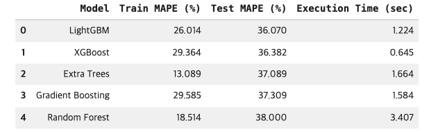
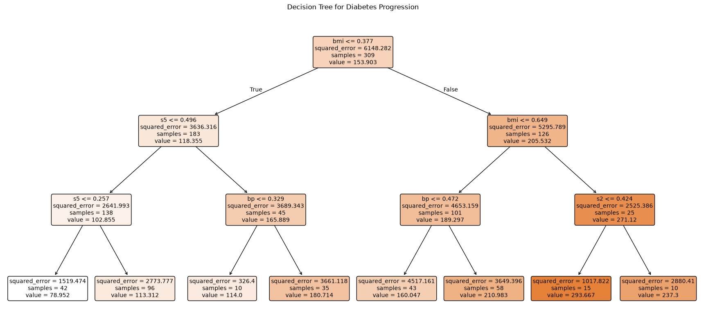
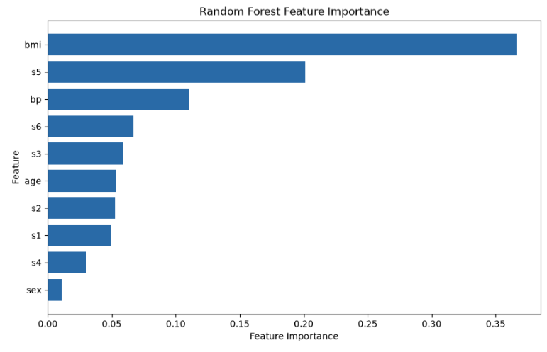

# Diabetes Progression Prediction

scikit-learn의 Diabetes 데이터셋으로 환자의 1년 후 당뇨병 진행 정도를 예측한 머신러닝 회귀 실습입니다. 작은 정형 데이터에 적합한 모델을 찾고, 예측 성능뿐 아니라 의사결정 규칙과 특성 중요도까지 함께 분석했습니다.

## 목표

1. 여러 회귀 모델의 Test MAPE를 비교해 최종 모델 선정
2. 깊이 3의 Decision Tree로 진행 정도가 높은 집단과 낮은 집단의 규칙 도출
3. Random Forest Feature Importance 상위 변수 확인

## 데이터

- 출처: [scikit-learn Diabetes dataset](https://scikit-learn.org/stable/modules/generated/sklearn.datasets.load_diabetes.html)
- 관측치: 442건
- 입력 변수: 10개 (`age`, `sex`, `bmi`, `bp`, `s1`~`s6`)
- Target: 1년 후 당뇨병 진행 정도
- 별도의 데이터 파일 없이 노트북에서 `load_diabetes()`로 불러옵니다.

## 분석 과정

```text
데이터 로드
  → Train/Test 7:3 분할
  → Train 중앙값 기준 결측 처리
  → Train 기준 Min-Max Scaling
  → 5개 회귀 모델 비교
  → Decision Tree 규칙 추출
  → Random Forest 특성 중요도 분석
```

하이퍼파라미터 자동 최적화는 사용하지 않고 직접 정한 후보 모델을 동일한 데이터 분할에서 비교했습니다.

## 모델 비교 결과



| 순위 | 모델 | Train MAPE | Test MAPE | 실행 시간 |
|:--:|:--|--:|--:|--:|
| 1 | LightGBM | 26.014% | **36.070%** | 1.224초 |
| 2 | XGBoost | 29.364% | 36.382% | 0.645초 |
| 3 | Extra Trees | 13.089% | 37.089% | 1.664초 |
| 4 | Gradient Boosting | 29.585% | 37.309% | 1.584초 |
| 5 | Random Forest | 18.514% | 38.000% | 3.407초 |

최종 모델은 Test MAPE가 가장 낮은 LightGBM입니다. Extra Trees는 Train MAPE가 가장 낮았지만 Train과 Test의 차이가 커 과적합 가능성을 확인할 수 있었습니다.

## Decision Tree 규칙



- 가장 높은 집단: `bmi > 0.649 AND s2 <= 0.424`
  - 평균 예측값: 293.667
  - 표본 수: 15
- 가장 낮은 집단: `bmi <= 0.377 AND s5 <= 0.257`
  - 평균 예측값: 78.952
  - 표본 수: 42

임계값은 Min-Max Scaling된 값이며, 집단 규칙은 인과관계가 아니라 학습된 트리의 분할 기준입니다.

## Random Forest 특성 중요도



| 순위 | 변수 | 중요도 |
|:--:|:--|--:|
| 1 | `bmi` | 0.3669 |
| 2 | `s5` | 0.2013 |
| 3 | `bp` | 0.1101 |

불순도 기반 중요도는 예측에 사용된 상대적 기여도를 나타내며 인과관계를 의미하지 않습니다.

## 실행 방법

### Google Colab

1. `diabetes_progression_ml.ipynb`를 Colab에 업로드합니다.
2. 필요한 경우 첫 셀에서 패키지를 설치합니다.
3. 런타임을 다시 시작한 뒤 모든 셀을 순서대로 실행합니다.

### 로컬 환경

```bash
python3 -m venv .venv
source .venv/bin/activate
python -m pip install -r requirements.txt
jupyter notebook diabetes_progression_ml.ipynb
```

## 파일 구성

```text
.
├── README.md
├── diabetes_progression_ml.ipynb
├── requirements.txt
├── LICENSE
└── assets/
│   ├── model-comparison.png
│   ├── decision-tree-rules.png
│   └── feature-importance.png
```

## 해석 시 주의사항

- 데이터가 작고 단일 Train/Test 분할을 사용했으므로 결과를 일반화할 때 주의해야 합니다.
- 실습 조건상 Test MAPE로 후보를 비교했지만, 실제 프로젝트에서는 Train 내부 검증 또는 교차검증으로 모델을 선택하고 Test는 마지막에 한 번만 평가하는 것이 적절합니다.
- 실행 시간은 Colab 환경과 패키지 버전에 따라 달라질 수 있습니다.
